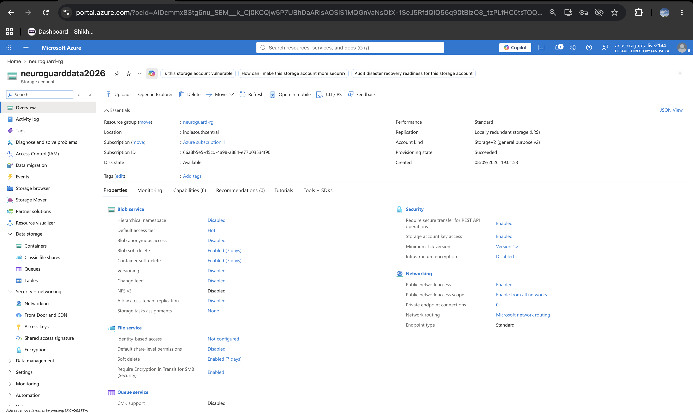
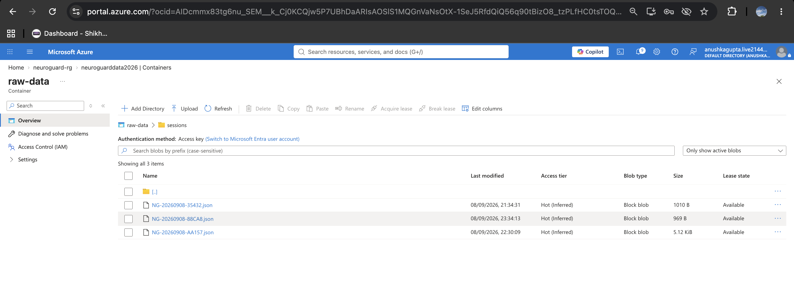
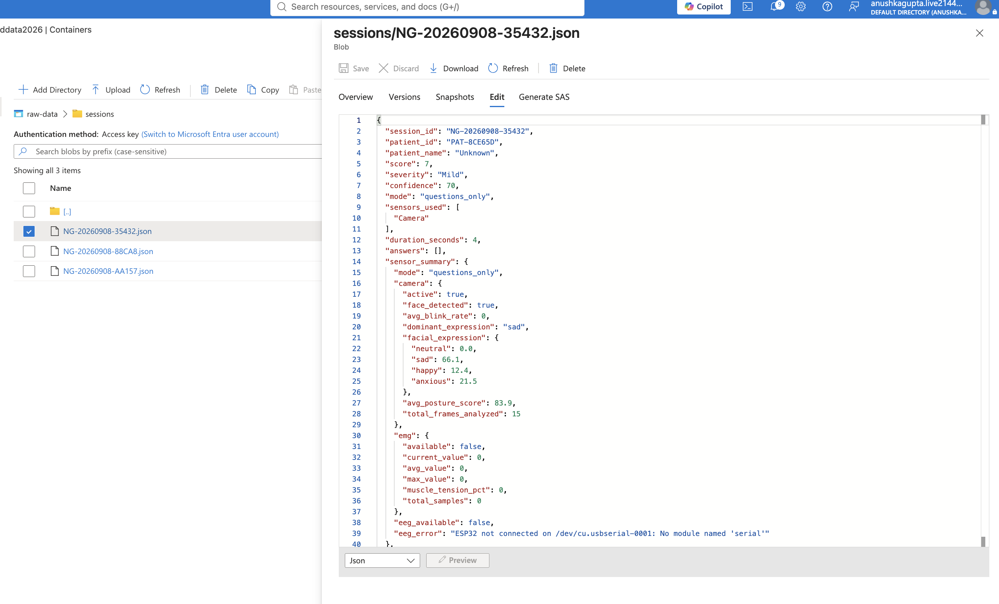
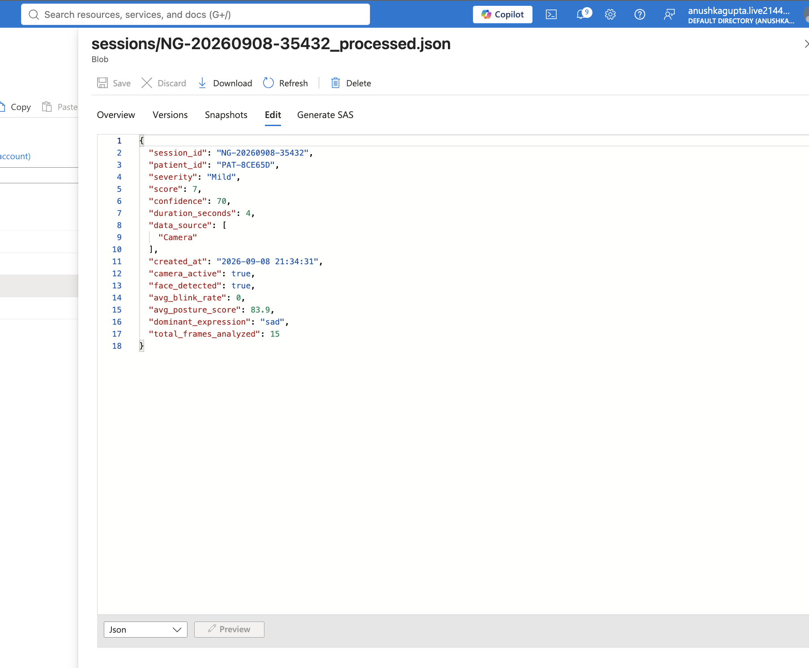
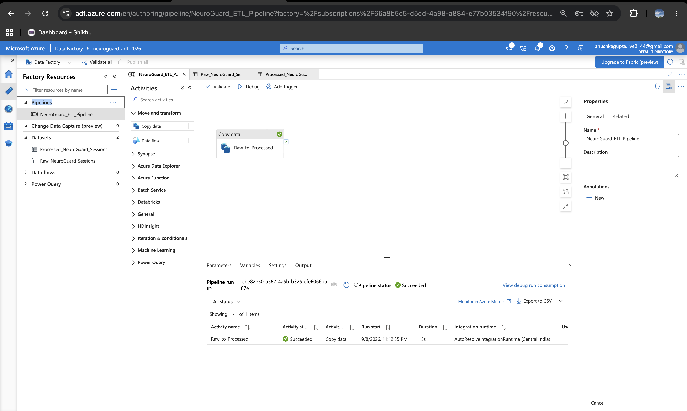
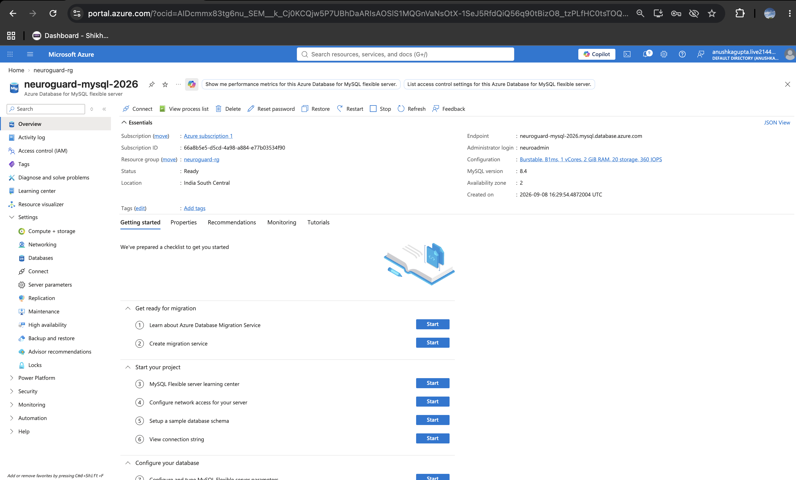
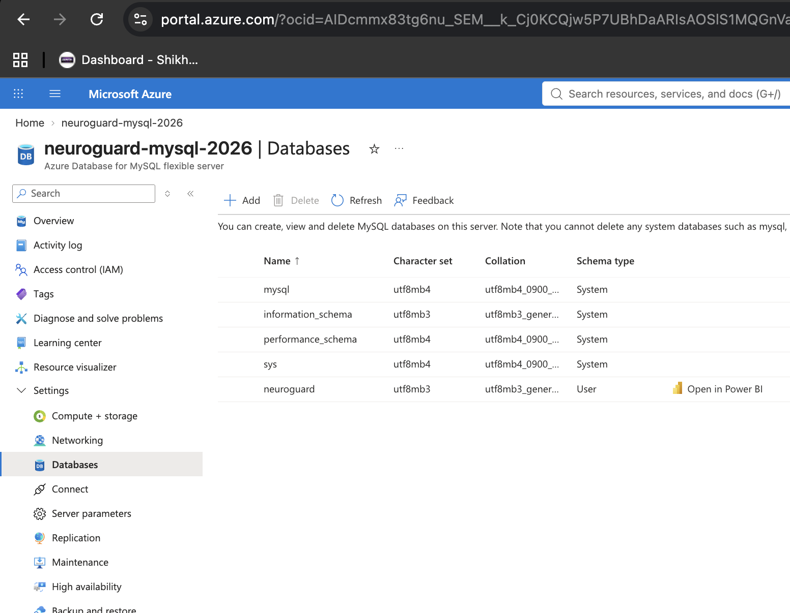

# 🧠 NeuroGuard Clinic

### Real-Time Multimodal Mental-Health Screening System using AI, IoT & Cloud Data Engineering

> **Computer Vision • Machine Learning • IoT • Flask • MySQL • Azure • ETL • Generative AI**

NeuroGuard Clinic is an end-to-end **multimodal mental-health screening prototype** that combines behavioral signals, physiological measurements, and questionnaire responses into a unified machine-learning pipeline.

Unlike a traditional questionnaire-only system, NeuroGuard integrates multiple data sources:

- 📷 **Computer Vision** — facial expression, blink rate and posture
- ❤️ **Physiological Signals** — heart rate, SpO₂ and HRV
- 📝 **PHQ-9 Questionnaire** — self-reported symptoms
- 🤖 **Machine Learning** — specialist models with stacking ensemble
- 🔌 **IoT** — ESP32 + MAX30102 sensor acquisition
- ⚡ **Flask** — real-time backend and REST APIs
- 🗄️ **MySQL** — structured session persistence
- ☁️ **Azure Blob Storage** — cloud data lake layer
- 🔄 **Azure Data Factory** — data pipeline orchestration
- ✨ **Groq LLM** — adaptive questions and AI-generated reports

The project demonstrates how heterogeneous real-time data can be transformed into a complete:

**Data Acquisition → Processing → ML Inference → Storage → ETL → Analytics → Reporting**

pipeline.

> ⚠️ **Important:** NeuroGuard is an academic/experimental prototype. It is **not a medical diagnostic system** and has not been clinically validated.

---

## 📌 Table of Contents

- [Why NeuroGuard?](#-why-neuroguard)
- [Key Features](#-key-features)
- [System Architecture](#-system-architecture)
- [Data Flow](#-data-flow)
- [Input Modalities](#-input-modalities)
- [Computer Vision Pipeline](#-computer-vision-pipeline)
- [IoT Physiological Pipeline](#-iot-physiological-pipeline)
- [PHQ-9 Pipeline](#-phq-9-pipeline)
- [Machine Learning Pipeline](#-machine-learning-pipeline)
- [Dataset](#-dataset)
- [Model Performance](#-model-performance)
- [Real-Time Inference](#-real-time-inference)
- [Graceful Degradation](#-graceful-degradation)
- [Cloud Data Engineering](#-cloud-data-engineering)
- [Azure Blob Storage](#-azure-blob-storage)
- [ETL Pipeline](#-etl-pipeline)
- [Azure Data Factory](#-azure-data-factory)
- [Database Architecture](#-database-architecture)
- [AI Report Generation](#-ai-report-generation)
- [Application Workflow](#-application-workflow)
- [Project Structure](#-project-structure)
- [Technology Stack](#-technology-stack)
- [Installation](#-installation)
- [Environment Variables](#-environment-variables)
- [Train the Models](#-train-the-models)
- [Run the Application](#-run-the-application)
- [Hardware Setup](#-hardware-setup)
- [Azure Setup](#-azure-setup)
- [API Endpoints](#-api-endpoints)
- [Engineering Decisions](#-engineering-decisions)
- [Fault Tolerance](#-fault-tolerance)
- [Results](#-results)
- [Limitations](#-limitations)
- [Future Improvements](#-future-improvements)
- [Disclaimer](#-disclaimer)

---

## 🎯 Why NeuroGuard?

Mental-health screening often depends heavily on self-reported questionnaires.

However, behavioral and physiological changes may also provide additional contextual information.

NeuroGuard explores the engineering problem:

> **How can heterogeneous real-time data sources be collected, processed, combined and stored in a single intelligent system?**

The system therefore treats mental-health screening as a **multimodal data-engineering and machine-learning problem**.

---

## 🚀 Key Features

### 🧠 Multimodal Analysis

```text
Camera
   +
MAX30102
   +
PHQ-9
   ↓
Feature Vector
   ↓
ML Ensemble
   ↓
Severity Prediction
```

### 📷 Real-Time Computer Vision

Extracts:

- Facial expression indicators
- Sadness percentage
- Blink rate
- Posture score
- Face detection status

### ❤️ Physiological Monitoring

Captures:

- Heart rate
- SpO₂
- Beat-to-beat intervals
- HRV (RMSSD, SDNN)

### 🤖 Ensemble Machine Learning

Uses:

- 5 specialist models
- 3 candidate meta-learners
- Stacking-based ensemble prediction

### ☁️ Cloud Data Pipeline

```text
Raw Data
   ↓
Azure Blob Storage
   ↓
ETL / Data Factory
   ↓
Processed Data
```

### 🗄️ Structured Persistence

Session metadata and analysis results are stored in MySQL.

### ✨ AI-Assisted Reporting

Groq LLM is used for:

- Adaptive questions
- Per-answer analysis
- Structured report generation

---

## 🏗️ System Architecture

```text
                         NEUROGUARD CLINIC
                                │
              ┌─────────────────┼─────────────────┐
              │                 │                 │
              ▼                 ▼                 ▼
           WEBCAM            ESP32             PHQ-9
              │              MAX30102          Survey
              │                 │                 │
              ▼                 ▼                 ▼
        Computer Vision    Physiological       Score
        Feature Extraction   Processing
              │                 │                 │
              └─────────────────┼─────────────────┘
                                │
                                ▼
                       Feature Engineering
                                │
                                ▼
                    Normalization / Validation
                                │
                                ▼
                  ┌─────────────────────────┐
                  │    Specialist Models    │
                  │                         │
                  │ Expression              │
                  │ Blink                   │
                  │ Posture                 │
                  │ Physiology              │
                  │ PHQ-9                   │
                  └────────────┬────────────┘
                               │
                               ▼
                      Stacking Meta-Learner
                               │
                               ▼
                      Severity Prediction
                               │
                     ┌─────────┴─────────┐
                     │                   │
                     ▼                   ▼
                 Flask API          Dashboard
                     │
          ┌──────────┼───────────┐
          │          │           │
          ▼          ▼           ▼
       MySQL      Azure Blob   Groq LLM
          │          │           │
          │          ▼           ▼
          │      Raw Sessions   AI Report
          │          │
          │          ▼
          │   Azure Data Factory
          │          │
          │          ▼
          │   Processed Data
          │
          ▼
     Session History
```

---

## 🔄 Data Flow

```text
1. Data Acquisition
       ↓
2. Feature Extraction
       ↓
3. Data Validation
       ↓
4. Feature Normalization
       ↓
5. Specialist ML Inference
       ↓
6. Ensemble Fusion
       ↓
7. Final Prediction
       ↓
8. Session Creation
       ↓
9. MySQL Persistence
       ↓
10. Azure Raw Data Storage
       ↓
11. ETL Processing
       ↓
12. Azure Processed Data
       ↓
13. Dashboard / Analytics
       ↓
14. AI-Assisted Report
```

---

## 📊 Input Modalities

| Modality | Source | Features |
|---|---|---|
| Behavioral | Webcam | Facial expression, blink rate, posture |
| Physiological | ESP32 + MAX30102 | Heart rate, SpO₂, HRV |
| Self-Reported | PHQ-9 | Questionnaire score |

The ML pipeline currently uses **7 core features**:

| Feature | Source | Range |
|---|---|---|
| `sad_expression` | Camera | 0–100 |
| `blink_rate` | Camera | 0–60 |
| `posture_score` | Camera | 0–100 |
| `heart_rate_bpm` | MAX30102 | 40–180 |
| `spo2` | MAX30102 | 70–100 |
| `hrv_rmssd` | MAX30102 | 0–150 |
| `phq9_base_score` | PHQ-9 | 0–27 |

> **Note:** The firmware and backend also ingest an EMG channel (raw value, muscle-activity flag, tension percentage). EMG is recorded in the session summary and shown on the dashboard, but it is **not** one of the seven ML input features in the current model.

---

## 👁️ Computer Vision Pipeline

The webcam stream is processed using:

- OpenCV
- MediaPipe FaceMesh
- MediaPipe Pose

### Processing Pipeline

```text
Camera Frame
     ↓
Face / Pose Detection
     ↓
Landmark Extraction
     ↓
Behavioral Feature Extraction
     ↓
┌────────────────────────────┐
│ Facial Expression          │
│ Blink Rate                 │
│ Posture Score              │
└────────────────────────────┘
     ↓
ML Feature Vector
```

**Facial Analysis** — the system derives facial indicators for Neutral, Happy, Sad and Anxious from landmark geometry (mouth openness, mouth-corner position, inner-brow height), smoothed over a rolling window.

**Blink Detection** — eye landmarks are used to compute the Eye Aspect Ratio (EAR); consecutive frames below threshold register a blink, and blinks are converted into a per-minute rate.

**Posture Analysis** — shoulder and nose landmarks from MediaPipe Pose are used to calculate a posture score from shoulder tilt, head offset and uprightness.

Frames are sent from the browser as base64 JPEG to `/api/camera_frame`; only the derived metrics are retained. **Raw frames are never stored or uploaded.**

---

## ❤️ IoT Physiological Pipeline

```text
MAX30102
    ↓
ESP32
    ↓
Serial Communication (115200 baud)
    ↓
Flask Backend (background reader thread)
    ↓
Physiological Feature Extraction
```

**Heart Rate**

```text
PPG Signal
    ↓
Beat Detection
    ↓
Heart Rate
```

**SpO₂** — red/infrared optical measurements are used by the sensor pipeline for SpO₂ estimation.

**HRV** — beat-to-beat intervals (IBIs) are collected on the backend and used to derive:

- RMSSD
- SDNN

The current ML pipeline uses `hrv_rmssd` as the HRV feature.

The serial manager reconnects automatically if the USB device is removed mid-session, and a live serial monitor is exposed at `/api/serial_log`.

---

## 📝 PHQ-9 Pipeline

NeuroGuard incorporates the 9-question PHQ-9 questionnaire. Each response is represented on a 0–3 scale:

| Value | Label |
|---|---|
| 0 | Not at all |
| 1 | Several days |
| 2 | More than half the days |
| 3 | Nearly every day |

The resulting score ranges from **0 → 27** and becomes one of the seven ML features.

---

## 🤖 Machine Learning Pipeline

NeuroGuard uses a **specialist + ensemble** architecture. Instead of feeding every feature into a single model, separate specialist models learn from different modalities.

```text
                  7 Input Features
                         │
       ┌─────────────────┼─────────────────┐
       │                 │                 │
       ▼                 ▼                 ▼
   Expression          Blink            Posture
       │                 │                 │
       └─────────────────┼─────────────────┘
                         │
                    Physiology
                         │
                       PHQ-9
                         │
                         ▼
                Specialist Predictions
                         │
                         ▼
                   Meta Features
                         │
                         ▼
                 Ensemble Learner
                         │
                         ▼
                  Final Prediction
```

### 🧩 Specialist Models

| # | Model | Inputs | Source |
|---|---|---|---|
| 1 | Expression Specialist | `sad_expression` | Webcam |
| 2 | Blink Specialist | `blink_rate` | Webcam |
| 3 | Posture Specialist | `posture_score` | Webcam |
| 4 | Physiological Specialist | `heart_rate_bpm`, `spo2`, `hrv_rmssd` | MAX30102 |
| 5 | PHQ-9 Specialist | `phq9_base_score` | Questionnaire |

Each specialist is a small dense network (ReLU + BatchNorm + Dropout) trained on its own engineered feature block — squared terms, deviations from population norms, and, for the physiological model, autonomic interaction terms such as the HR/RMSSD ratio.

### 🔗 Stacking Ensemble

The specialist models produce probability predictions, which are concatenated with the original normalized features:

```text
7 Raw Normalized Features
            +
5 × 3 Class Probabilities
            =
22 Meta Features
```

The 22-dimensional representation is passed to the meta-learner. Three meta-learners are trained and evaluated:

- Gradient Boosting
- Random Forest
- Dense Neural Network

The best-performing model is selected automatically and persisted, along with an `ensemble_config.json` describing which learner won.

---

## 📚 Dataset

The training pipeline generates **25,000 synthetic samples** with 7 features and 3 classes, using class-conditional distributions anchored to published clinical literature (facial affect, blink rate, posture, resting HR, SpO₂, HRV/RMSSD and PHQ-9 ranges). A 3% label-noise injection is applied for robustness.

### Classes

```text
0 → Normal
1 → Mild / Moderate
2 → Severe
```

### Dataset Split

```text
75% → Training
15% → Validation
10% → Testing
```

Resulting split:

```text
Training   → 18,742
Validation → 3,758
Testing    → 2,500
```

The dataset is generated programmatically and exported as `neuroguard_synthetic_data.csv` (written next to the training script, in `python_core/`).

---

## 📈 Model Performance

Current experimental results:

| Model | Validation Accuracy |
|---|---|
| Expression | 92.79% |
| Blink | 82.76% |
| Posture | 86.91% |
| Physiology | 87.84% |
| PHQ-9 | 92.79% |
| Gradient Boosting (meta) | 97.63% |
| Random Forest (meta) | 98.03% |
| DNN (meta) | 98.00% |

**Final ensemble:**

```text
Validation Accuracy → 98.03%
Test Accuracy       → 98.16%
```

### Important Interpretation

These results are obtained on the project's **synthetic** experimental dataset, where class-conditional distributions are well separated by construction. They measure that the pipeline learns the generated structure correctly — they should **not** be interpreted as clinical accuracy.

---

## ⚡ Real-Time Inference

During a live session, the application continuously collects available features. The model input is:

```python
[
    sad_expression,
    blink_rate,
    posture_score,
    heart_rate_bpm,
    spo2,
    hrv_rmssd,
    phq9_base_score
]
```

The inference pipeline is:

```text
Raw Features
     ↓
Normalization
     ↓
5 Specialist Models
     ↓
Probability Predictions
     ↓
22 Meta Features
     ↓
Meta-Learner (Random Forest selected)
     ↓
Class Probabilities → 0–27 Score
     ↓
Severity
     ↓
Confidence
```

The three class probabilities are mapped onto the PHQ-9 0–27 scale and blended with the raw questionnaire total, so the reported score stays interpretable against standard PHQ-9 severity bands. If the ensemble is unavailable, the backend falls back to the combined 7-feature model, and finally to a transparent rule-based heuristic.

---

## 🛡️ Graceful Degradation

A major engineering goal of NeuroGuard is to prevent a single unavailable sensor from bringing down the entire system.

| Mode | Available Sources |
|---|---|
| Full Multimodal | Camera + MAX30102 + PHQ-9 |
| Camera Mode | Camera + PHQ-9 |
| Physiological Mode | MAX30102 + PHQ-9 |
| Questionnaire Mode | PHQ-9 |

The application detects the active mode on every request, reports the currently available sensor sources to the dashboard, and continues processing using whatever data is present. Confidence is scaled down accordingly.

---

## ☁️ Cloud Data Engineering

NeuroGuard separates operational application data from cloud data storage.

```text
                     Azure Storage Account
                              │
              ┌───────────────┼───────────────┐
              │               │               │
              ▼               ▼               ▼
        training-data     raw-data      processed-data
                              │               │
                              ▼               │
                         sessions/            │
                              │               │
                              └──────┐        │
                                     ▼        │
                              ETL Processing  │
                                     │        │
                                     └────────┘
```



---

## 🗄️ Azure Blob Storage

Three containers are used.

### `training-data`

Stores the ML training dataset:

```text
training-data/
└── neuroguard_synthetic_data.csv
```

### `raw-data`

Stores completed application sessions. Every finished assessment is uploaded from the Flask backend as a single compact JSON document — **never camera frames or landmark streams**:

```text
raw-data/
└── sessions/
    ├── NG-20260908-A1B2C.json
    ├── NG-20260908-D3E4F.json
    └── ...
```



A stored raw session document:



### `processed-data`

Stores transformed analytical records produced by the ETL job:

```text
processed-data/
└── sessions/
    ├── session_001_processed.json
    ├── session_002_processed.json
    └── ...
```



A transformed analytical record:


This creates a simple **raw → processed** data-layer architecture.

---

## 🔄 ETL Pipeline

NeuroGuard implements an ETL workflow in `python_core/azure_etl.py`.

```text
                 RAW LAYER
                     │
                     ▼
              Extract JSON
                     │
                     ▼
              Validate Data
                     │
                     ▼
             Transform Fields
                     │
                     ▼
              PROCESSED LAYER
```

### Extract

Session JSON is retrieved from `raw-data/sessions/`.

### Validate

Important fields are checked before processing:

| Field | Rule |
|---|---|
| `session_id` | required |
| `score` | 0–27 |
| `confidence` | 0–100 |
| `duration` | non-negative |

Invalid records are rejected.

### Transform

Raw session information is converted into a compact analytical structure:

```json
{
  "session_id": "NG-20260908-XXXX",
  "patient_id": "PAT-XXXX",
  "severity": "Mild",
  "score": 7,
  "confidence": 70,
  "duration_seconds": 4,
  "data_source": ["Camera"],
  "camera_active": true,
  "face_detected": true,
  "avg_blink_rate": 0,
  "avg_posture_score": 83.9,
  "dominant_expression": "sad",
  "total_frames_analyzed": 15
}
```

### Load

The transformed record is written to `processed-data/sessions/`, creating an analytics-ready representation separate from the original raw session.

---

## 🔄 Azure Data Factory

Azure Data Factory provides the orchestration / data-movement layer for the cloud pipeline.

```text
Azure Blob Storage
       │
       ▼
raw-data/sessions/
       │
       ▼
Azure Data Factory
       │
       ▼
Copy / Pipeline Activity
       │
       ▼
processed-data/sessions/
```

### Pipeline Structure

```text
NeuroGuard ETL Pipeline
          │
          ▼
Raw NeuroGuard Sessions
          │
          ▼
Copy Activity
          │
          ▼
Processed NeuroGuard Sessions
```



The pipeline automates movement of session data between the raw and processed storage layers.

---

## 🗃️ Database Architecture

NeuroGuard uses **Azure Database for MySQL** for structured operational data.



The session table stores:

| Column | Description |
|---|---|
| `session_id` | Unique assessment identifier |
| `patient_id` | Patient reference |
| `patient_name` | Patient display name |
| `score` | Final fused score (0–27) |
| `severity` | Predicted severity band |
| `confidence` | Confidence percentage |
| `mode` | Active sensor mode |
| `sensors_used` | List of contributing sources |
| `duration_seconds` | Session length |
| `answers` | PHQ-9 answers + per-answer AI analysis |
| `sensor_summary` | Aggregated camera / EMG / sensor metrics |
| `report` | Generated AI report |
| `created_at` | Timestamp |



### Storage Separation

```text
             NeuroGuard Data
                   │
        ┌──────────┴──────────┐
        │                     │
        ▼                     ▼
   Azure Blob               MySQL
        │                     │
        ▼                     ▼
Raw / Processed          Structured Data
Training Files           Session Records
```

Blob Storage is used for semi-structured/object data, while MySQL handles structured application records. If MySQL is unreachable, the backend falls back to in-memory session storage so the assessment can still complete.

---

## ✨ AI Report Generation

Groq LLM integration provides experimental AI-assisted functionality.

**Adaptive Questions** — after the first four standard PHQ-9 items, the system can generate context-aware follow-up questions informed by previous answers and current sensor observations.

**Per-Answer Analysis** — each submitted answer is analyzed alongside the sensor snapshot captured at answer time.

**Final Report** — after the assessment, the LLM generates a structured report containing:

- Executive summary
- Key observations
- Sensor analysis
- Risk assessment
- Recommendations

Report generation runs in a background thread so the `/api/end_test` request is not blocked; the frontend polls `/api/report_status/<session_id>` until it completes. If Groq is unavailable, the session is still scored, saved and uploaded — only the narrative report is skipped.

---

## 🖥️ Application Workflow

```text
Open Dashboard
      ↓
Camera Initialization
      ↓
ESP32 Detection
      ↓
Start Test
      ↓
Create Session
      ↓
PHQ-9 Questions
      ↓
Capture Behavioral Features
      ↓
Capture Physiological Features
      ↓
ML Inference
      ↓
Final Score / Severity
      ↓
Upload Session to Azure Blob
      ↓
Generate AI Report (async)
      ↓
Save Session to MySQL
      ↓
Process Data through ETL
      ↓
Store Processed Data
```

---

## 📁 Project Structure

```text
NeuroGuard/
│
├── backend/
│   ├── app.py                  # Flask application
│   ├── database.py             # MySQL persistence
│   ├── models.py               # PHQ-9 / application models
│   ├── groq_report.py          # Groq integration
│   │
│   └── models/
│       ├── expression_model.h5
│       ├── blink_model.h5
│       ├── posture_model.h5
│       ├── physio_model.h5
│       ├── phq9_model.h5
│       ├── meta_learner.pkl
│       ├── ensemble_config.json
│       ├── training_results.json
│       └── ...
│
├── python_core/
│   ├── train_model.py          # ML training pipeline
│   ├── preprocessing.py        # Data preprocessing
│   ├── feature_extraction.py   # Feature extraction
│   ├── azure_etl.py            # Azure ETL
│   ├── azure_test.py           # Azure connection test
│   ├── azure_upload_test.py    # Azure upload test
│   └── neuroguard_synthetic_data.csv
│
├── hardware/
│   └── esp32_sensor_hub.ino    # ESP32 + MAX30102 firmware
│
├── frontend/
│   ├── templates/
│   │   ├── index.html
│   │   ├── dashboard.html
│   │   ├── history.html
│   │   ├── report.html
│   │   └── settings.html
│   │
│   └── static/
│       ├── css/
│       └── js/
│
├── images/                     # Documentation screenshots
├── requirements.txt
├── .env
├── .gitignore
└── README.md
```

---

## 🛠️ Technology Stack

| Layer | Technologies |
|---|---|
| Programming | Python, C++ |
| ML | TensorFlow, Scikit-learn |
| Data Processing | NumPy, Pandas |
| Computer Vision | OpenCV, MediaPipe |
| Backend | Flask, REST APIs |
| Database | MySQL |
| IoT | ESP32, MAX30102 |
| Cloud | Microsoft Azure |
| Object Storage | Azure Blob Storage |
| Data Engineering | Azure Data Factory, Python ETL |
| GenAI | Groq API |
| Frontend | HTML, CSS, JavaScript, Bootstrap, Chart.js |

---

## ⚙️ Installation

### 1. Clone the Repository

```bash
git clone <your-repository-url>
cd NeuroGuard
```

### 2. Create Environment

```bash
conda create -n neuroguard python=3.12
conda activate neuroguard
```

### 3. Install Dependencies

```bash
pip install -r requirements.txt
```

If required:

```bash
pip install numpy pandas scikit-learn tensorflow
pip install opencv-python mediapipe
pip install flask python-dotenv
pip install mysql-connector-python
pip install azure-storage-blob
pip install pyserial
```

---

## 🔐 Environment Variables

Create a `.env` file in the project root:

```bash
# Azure
AZURE_STORAGE_CONNECTION_STRING=your_connection_string

# MySQL
MYSQL_HOST=your_mysql_server.mysql.database.azure.com
MYSQL_USER=your_username
MYSQL_PASSWORD=your_password
MYSQL_DB=neuroguard

# Groq
GROQ_API_KEY=your_groq_api_key

# ESP32
SERIAL_PORT=/dev/cu.usbserial-0001
BAUD_RATE=115200
```

### Security

Never commit secrets. Add `.env` to `.gitignore`.

---

## 🧠 Train the Models

```bash
python3 python_core/train_model.py
```

The training pipeline:

```text
Generate Dataset
      ↓
Save Dataset CSV
      ↓
Normalize Features
      ↓
Train / Validation / Test Split
      ↓
Train Specialist Models
      ↓
Generate Specialist Predictions
      ↓
Train Meta-Learners
      ↓
Select Best Model
      ↓
Evaluate Test Set
      ↓
Save Models
```

| Output | Path |
|---|---|
| Generated dataset | `python_core/neuroguard_synthetic_data.csv` |
| Saved models | `backend/models/` |
| Ensemble config | `backend/models/ensemble_config.json` |
| Training results | `backend/models/training_results.json` |

---

## ▶️ Run the Application

```bash
python3 backend/app.py
```

The application runs on:

```text
http://127.0.0.1:5001
```

On startup the backend reports the status of every optional dependency:

```text
============================================================
  NeuroGuard Clinic – Starting Server (REAL DATA MODE)
  Database: ✅ MySQL
  Groq LLM: ✅ Connected
  ESP32:    ✅ Connected
  Azure:    ✅ Blob Storage (raw-data)
  Open http://127.0.0.1:5001 in your browser
============================================================
```

---

## 🔌 Hardware Setup

### Components

- ESP32 DevKit
- MAX30102
- USB Cable

### Wiring

```text
MAX30102       ESP32

VIN    ───────→ 3.3V
GND    ───────→ GND
SDA    ───────→ GPIO 21
SCL    ───────→ GPIO 22
```

Open `hardware/esp32_sensor_hub.ino` in the Arduino IDE, select **ESP32 Dev Module**, and upload the firmware. Use **115200 baud** for serial monitoring.

The firmware emits line-oriented telemetry that the backend parses:

```text
DATA:IR=...,RED=...,HR=...,SPO2=...,EMG=...,MUSCLE=...,BEAT=...,BAVG=...,TS=...
STATUS:FINGER_DETECTED
```

---

## ☁️ Azure Setup

The cloud environment contains:

```text
Azure Resource Group
        │
        ├── Azure Storage Account
        │      ├── training-data
        │      ├── raw-data
        │      └── processed-data
        │
        ├── Azure Database for MySQL
        │
        └── Azure Data Factory
```

### Azure Blob Containers

Create `training-data`, `raw-data` and `processed-data`, then upload `neuroguard_synthetic_data.csv` to `training-data`.

### Test Azure Connection

```bash
python3 python_core/azure_test.py
```

Expected:

```text
✓ Azure Blob Storage connection successful!
✓ Storage Account connected
✓ Container accessible
```

### Test Upload

```bash
python3 python_core/azure_upload_test.py
```

This verifies that session JSON can be uploaded to the raw data layer.

### Run ETL

```bash
python3 python_core/azure_etl.py
```

Expected:

```text
✓ Raw data extracted
✓ Validation passed
✓ Data transformed
✓ Processed data uploaded

========== ETL COMPLETE ==========
Extract   : ✓
Validate  : ✓
Transform : ✓
Load      : ✓
```

---

## 🔌 API Endpoints

| Endpoint | Method | Purpose |
|---|---|---|
| `/api/camera_frame` | POST | Process camera frames |
| `/api/sensor_data` | GET | Retrieve current sensor data |
| `/api/serial_log` | GET | Live ESP32 serial monitor |
| `/api/start_test` | POST | Start assessment session |
| `/api/analyze_next_question` | POST | Generate/process next question |
| `/api/submit_answer` | POST | Submit questionnaire answer |
| `/api/end_test` | POST | Finalize assessment |
| `/api/report_status/<session_id>` | GET | Check report generation |
| `/api/delete_session/<session_id>` | DELETE | Delete a stored session |
| `/api/settings` | POST | Update runtime configuration |
| `/api/status` | GET | System/service status |

---

## 🧩 Engineering Decisions

### Why Specialist Models?

Each modality behaves differently:

```text
Camera       → Behavioral
MAX30102     → Physiological
PHQ-9        → Self-reported
```

Specialist models allow each signal group to be modeled independently before ensemble fusion, and make it possible to reason about which modality drove a prediction.

### Why Ensemble Learning?

A single modality can be incomplete or noisy. The stacking ensemble combines predictions from Expression, Blink, Posture, Physiology and PHQ-9 into a single decision, and the meta-learner also sees the raw normalized features — so it can learn when to distrust a given specialist.

### Why Blob Storage?

Blob Storage provides a separate cloud storage layer for training datasets, raw sessions and processed sessions. This decouples data storage from the Flask application and keeps the analytical layer independent of the operational database.

### Why MySQL?

MySQL is used for structured operational data where querying individual sessions and metadata is useful — the history page, report retrieval and session deletion all read from it.

### Why Azure Data Factory?

ADF introduces a managed orchestration layer for data movement:

```text
Raw Data
   ↓
ADF
   ↓
Processed Data
```

This makes the project closer to a real cloud data-engineering workflow than a standalone script.

---

## 🧯 Fault Tolerance

The system is designed around graceful degradation. If a component becomes unavailable:

| Failure | Behaviour |
|---|---|
| ESP32 unavailable | Falls back to camera / questionnaire mode; auto-reconnects in the background |
| Groq unavailable | Core assessment continues; narrative report skipped |
| MySQL unavailable | In-memory session fallback |
| Azure unavailable | Cloud upload failure is logged; the app continues normally |
| Models unavailable | Falls back to combined model, then to rule-based heuristics |

This prevents optional dependencies from becoming single points of failure for the entire prototype.

---

## 📊 Results

### Machine Learning

- 25,000 synthetic samples
- 7 input features
- 3 target classes
- 5 specialist models
- 3 candidate meta-learners
- 98.03% validation accuracy
- 98.16% test accuracy

### Computer Vision

- Real-time webcam processing
- Facial analysis
- Blink detection
- Posture analysis

### IoT

- ESP32 + MAX30102
- Heart rate, SpO₂, HRV
- EMG channel ingestion
- Serial data ingestion with auto-reconnect

### Backend

- Flask REST APIs
- Session management
- Real-time inference

### Database

- MySQL structured session storage
- Historical session records

### Cloud

- Azure Blob Storage (training / raw / processed layers)
- Azure Data Factory ETL orchestration

### Generative AI

- Adaptive questions
- Per-answer analysis
- AI-assisted report generation

---

## 🏆 What Makes This Project Strong?

NeuroGuard is designed as more than an ML model. It combines multiple engineering disciplines:

```text
                  NeuroGuard
                      │
       ┌──────────────┼──────────────┐
       │              │              │
       ▼              ▼              ▼
 Computer Vision     IoT          Questionnaire
       │              │              │
       └──────────────┼──────────────┘
                      ▼
               Feature Engineering
                      │
                      ▼
                ML Ensemble
                      │
                      ▼
                Flask Backend
                      │
             ┌────────┴────────┐
             ▼                 ▼
           MySQL           Azure Blob
                               │
                               ▼
                       Azure Data Factory
                               │
                               ▼
                       Processed Data
                               │
                               ▼
                         AI Reporting
```

This creates an end-to-end system spanning:

**AI + ML + Computer Vision + IoT + Backend + Database + Cloud + Data Engineering + Generative AI**

---

## ⚠️ Limitations

**Synthetic Dataset** — the ML models are trained entirely on synthetic data generated from literature-anchored distributions. The reported accuracy represents performance on that experimental dataset, not on real clinical data. Because the classes are separable by construction, the high accuracy should be read as a check that the pipeline works, not as evidence of real-world predictive power.

**No Clinical Validation** — the system has not undergone clinical trials or medical validation, and the mapping from model output to PHQ-9 severity bands is a design choice, not a validated instrument.

**Hardware Dependency** — physiological measurements depend on the availability and quality of ESP32/MAX30102 data; finger placement and motion artefacts materially affect HRV.

**Computer Vision Sensitivity** — lighting, camera angle, facial orientation and image quality influence the extracted behavioral features. The expression heuristics are geometric, not a trained affect classifier.

**Prototype Architecture** — the implementation demonstrates an end-to-end architecture but is not designed for production healthcare deployment, and does not implement clinical-grade data governance.

---

## 🔮 Future Improvements

### Data Engineering

- Automated scheduled ETL triggers in Azure Data Factory
- Incremental / watermark-based processing instead of full-container scans
- Partitioned storage layout (`year/month/day`) for the raw layer
- Data-quality metrics and rejection logging

### Machine Learning

- Validation against a real, labelled clinical dataset
- Per-modality confidence weighting when sensors are missing
- Model explainability (feature attribution per prediction)
- Model versioning and drift monitoring

### Application

- Authentication and role-based access
- Encryption of session data at rest and in transit
- Analytics dashboard built on the processed layer
- Containerized deployment (Docker + Azure App Service)

### Hardware

- Additional physiological channels
- Improved motion-artefact rejection
- Wireless sensor transport instead of USB serial

---

## 📜 Disclaimer

NeuroGuard Clinic is an **academic and experimental prototype**.

It is **not** a medical device, **not** a diagnostic tool, and has **not** been clinically validated. It must not be used to diagnose, treat, or make decisions about any medical or mental-health condition.

If you or someone you know needs support, please contact a qualified healthcare professional.

---

<div align="center">

**Built with Python, TensorFlow, MediaPipe, Flask, MySQL and Microsoft Azure**

</div>